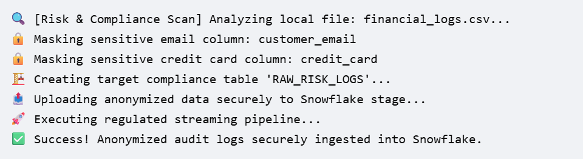

# ❄️ snow-shield

**snow-shield** is a lightweight command-line intelligence tool built for risk, fraud, and regulatory audit ingestion into Snowflake. 

## 💡 The Problem
In compliance-heavy sectors (GDPR, PCI-DSS, HIPAA), data engineers frequently handle transaction and audit logs that contain hidden Personally Identifiable Information (PII) like unencrypted emails or credit card details. Directly uploading these raw logs into a cloud environment creates a massive regulatory liability.

## 🚀 The Solution
`snow-shield` serves as a local gatekeeper utility that intercepts ingestion scripts:
1. **PII Risk Scopes:** Runs a local semantic audit on column metadata.
2. **Deterministic Masking:** Automatically hashes or masks exposed user fields (emails, credit card formats) on the fly before data ever leaves local systems.
3. **Structured Ingestion:** Handles zero-config schema inference and streams compliance-ready tables straight into Snowflake.

## 🛠️ Usage
```bash
python snowshield.py ingest --file financial_logs.csv --table regulatory_audit_log
```

